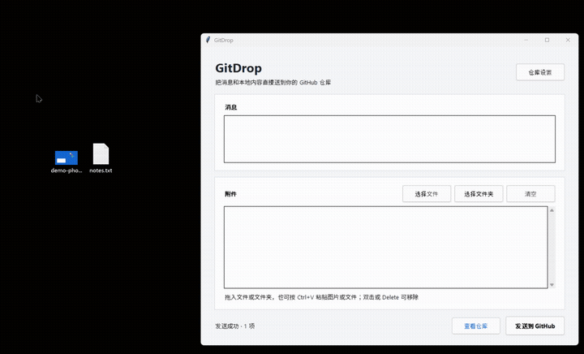

# GitDrop

当前版本：`v0.2.1`

GitDrop 是一个面向 Windows 和 macOS 的轻量桌面工具。输入消息，拖入图片、文件或文件夹，即可将它们同步到自己的 GitHub 仓库。



## 快速开始

### 1. 安装 Git

- Windows：安装 [Git for Windows](https://git-scm.com/download/win)。
- macOS：打开“终端”并输入 `git --version`。如果尚未安装，系统会提示安装 Xcode Command Line Tools。

### 2. 下载 GitDrop

前往 [Releases](https://github.com/jiale-wangOwO/gitdrop/releases/latest) 下载并解压：

- Windows 下载类似 `GitDrop-v0.2.1-Windows.zip` 的压缩包，运行其中带版本号的 `.exe` 文件。
- macOS 下载类似 `GitDrop-v0.2.1-macOS.zip` 的压缩包，运行其中带版本号的 `.app` 应用。

macOS 首次打开未签名应用时，请右键点击带版本号的 `.app` 应用，选择“打开”，再确认运行。

### 3. 创建 GitHub Token

1. 打开 GitDrop 的“仓库设置”。
2. 点击“打开 GitHub 创建 Token”。
3. 在 GitHub 页面保留已勾选的 `repo` 权限，然后点击页面底部的 `Generate token`。
4. 立即复制生成的 Token。GitHub 只会显示一次。

### 4. 完成仓库设置

在 GitDrop 中填写：

- `GitHub 用户名`：你的 GitHub 登录名。
- `仓库名`：默认是 `gitdrop-inbox`，也可以修改。
- `访问令牌`：粘贴上一步生成的 Token。

点击“保存设置”后，GitDrop 会立即检查远端仓库：

- 同名仓库已存在：直接连接，并显示“查看仓库”。
- 同名仓库不存在：首次发送时自动创建一个私有仓库。

### 5. 发送内容

1. 输入消息，可留空。
2. 将文件、图片或文件夹拖入附件区域，也可以使用选择按钮。
3. 点击“发送到 GitHub”。
4. 发送完成后点击“查看仓库”检查内容。

## 功能

- 发送纯文本消息，自动保存为 Markdown
- 选择或拖入多个文件、图片和文件夹
- 在窗口内按 `Ctrl+V` / `Cmd+V` 直接添加剪贴板图片、文件或文件夹
- 一次发送生成一个 Git commit
- 默认仓库名为 `gitdrop-inbox`；同名仓库存在时复用，不存在时自动创建私有仓库
- 设置页可手动清空仓库内容，操作前会二次确认
- 文件夹结构和文件名保持不变
- 支持 Windows 和 macOS

同步后的目录结构：

```text
inbox/
  2026-07-31_14-30-00/
    message.md
    example.png
    selected-folder/
      document.pdf
```

## 数据与安全

- Token 通过系统 Git 凭据管理器保存，不写入项目配置。
- 每次发送只在工具目录创建临时 `.gitdrop-cache`，操作结束后立即删除。
- “清空仓库内容”会创建一个删除文件的提交，仓库和历史记录仍然保留。

## 常见操作

- 更换仓库：打开“仓库设置”，修改仓库名并保存。
- 查看远端内容：连接成功后点击“查看仓库”。
- 清空远端内容：在“仓库设置”中点击“清空仓库内容”，确认后删除当前分支中的文件。仓库和提交历史不会被删除。
- 不保存 Token：取消勾选“使用 Git 凭据管理器记住 Token”。

### macOS 代理和公司网络

GitDrop 会按以下顺序查找可供 Git 子进程使用的代理：

1. `GITDROP_HTTPS_PROXY`
2. `HTTPS_PROXY` / `https_proxy`
3. `ALL_PROXY` / `all_proxy`
4. `HTTP_PROXY` / `http_proxy`
5. macOS 系统 HTTP/HTTPS 代理

例如，可以从终端为本次启动显式指定代理：

```bash
GITDROP_HTTPS_PROXY=http://127.0.0.1:1082 \
  "/Applications/GitDrop-v0.2.1.app/Contents/MacOS/GitDrop-v0.2.1"
```

如果使用 Shadowrocket、Clash、Surge 或其他 Fake-IP/TUN 代理，并遇到
`SSL_ERROR_SYSCALL`、`Connection reset by peer` 或 `Recv failure`，请确认：

- 本地代理端口正在监听；
- `github.com` 命中代理而不是 `DIRECT`；
- 当前代理节点可访问 GitHub；
- 未将 `198.18.0.0/15` 中的 Fake-IP 当作真实 GitHub 地址直接访问。

请勿通过关闭 Git 的 `http.sslVerify` 解决连接问题。GitDrop 会保持 TLS 证书验证开启。

## 从源码运行

仓库中提供 `start_gitdrop.bat`（Windows）和 `start_gitdrop.command`（macOS）。启动器会在首次运行时自动安装拖放组件，电脑需要 Python 3 和 Git。

## 限制

- GitHub 单文件上限为 100 MB。
- 空文件夹不会被 Git/GitHub 保存。
- 同一分支若恰好被其他客户端同时更新，本次发送会失败；重新发送即可。

## License

[MIT](LICENSE)
